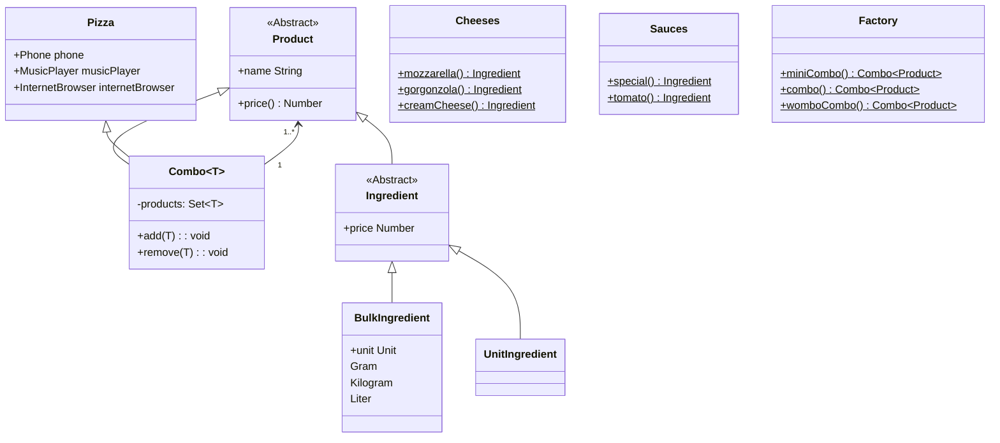

# Introdução
Nesse desafio foram implementados os padrões de projeto Composite, Factory Method, Abstract Factory e Strategy. O contexto trabalhado foi o de uma pizzaria, ela trabalha com venda de combos e tem a necessidade de calcular preços deles com base nos ingredientes e outros produtos inclusos nos combos.

A ideia do uso do composite foi relacionar ingrediente (Componente Folha do Composite) com pizzas e combos (Componentes Árvores do Composite), dessa forma fica intuitivo a construção e definição dos produtos e o código cliente pode trabalhar tanto com venda de ingredientes quanto com venda de produtos mais complexos. As factories foram utilizadas para facilitar a criação de produtos específicos como porções de molhos, queijos e refrigerantes e  que são utilizadas nas pizzas e/ou combos. Finalizando as explicações dos padrões utilizados temos o Strategy que foi utilizado para definir a API de um ingrediente, dessa forma foi possível definir ingredientes medidos por unidade e ingredientes medidos por grama, quilograma e litro que são importantes para construcao de custos e receitas de pizzas e combos.

Obs: A aplicação é executada com interação via terminal onde podemos visualizar os combos.

# Diagrama

